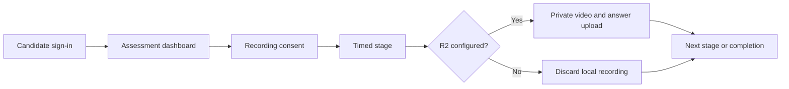

# Secmentum

**A customizable internship assessment tool.**

[](https://nodejs.org/)
[](https://expressjs.com/)
[](LICENSE)

Secmentum is an open-source starter for timed candidate assessments. It includes sequential stages, configurable questions, fullscreen and tab-change checks, camera/microphone recording, resilient browser-side recording chunks, and optional private Cloudflare R2 storage.

> This repository is a demo/starter, not a production hiring platform. It has no admin panel, database, scoring engine, tenant isolation, or automated hiring decisions.

## Highlights

- One JSON file controls branding, stages, durations, and questions.
- Three sample stages: Work Style, English Communication, and Problem Solving.
- Candidate access-code flow with server-side sessions.
- Camera and microphone consent before each recorded stage.
- Recording chunks kept in IndexedDB until the stage finishes.
- Private R2 upload when configured; safe discard mode when it is not.
- No real candidate records, company contact details, or cloud credentials.

## How it works



## Quick start

Requirements: Node.js 20 or newer.

```bash
git clone <your-repository-url>
cd secmentum
npm install
copy .env.example .env
npm start
```

Open `http://localhost:2500` and use the development code `DEMO-ACCESS`.

On macOS or Linux, replace the copy command with `cp .env.example .env`.

## Customize the assessment

Edit [`assessment.config.json`](assessment.config.json):

```json
{
  "brand": {
    "name": "Secmentum",
    "tagline": "A customizable internship assessment tool"
  },
  "stages": [
    {
      "id": 1,
      "title": "Work Style",
      "durationMinutes": 5,
      "questions": [
        {
          "id": 1,
          "text": "Your question",
          "options": ["Option A", "Option B"]
        }
      ]
    }
  ]
}
```

Use an empty `options` array for a free-text response. Keep stage IDs sequential, starting at `1`.

## Environment

| Variable | Required | Purpose |
| --- | --- | --- |
| `PORT` | No | HTTP port; defaults to `2500` |
| `ACCESS_CODE` | Production | Candidate access code |
| `SESSION_SECRET` | Production | Session signing secret; use at least 32 random characters |
| `R2_ENDPOINT` | For uploads | Cloudflare R2 S3 endpoint |
| `R2_REGION` | For uploads | Usually `auto` |
| `R2_ACCESS_KEY_ID` | For uploads | R2 access key ID |
| `R2_SECRET_ACCESS_KEY` | For uploads | R2 secret access key |
| `R2_BUCKET_NAME` | For uploads | Private R2 bucket |

If all R2 values are absent, Secmentum stays usable in demo mode. Recording still runs locally, then the browser data is discarded instead of uploaded.

## API

| Method | Route | Purpose |
| --- | --- | --- |
| `GET` | `/api/config` | Public brand and storage status |
| `POST` | `/api/login` | Start a candidate session |
| `GET` | `/api/dashboard` | Candidate and stage progress |
| `GET` | `/api/stages/:id/questions` | Questions for the available stage |
| `POST` | `/api/stage/start` | Start the next stage |
| `POST` | `/api/upload` | Upload a WebM recording, maximum 256 MB |
| `POST` | `/api/upload-answers` | Upload the text answer report |
| `POST` | `/api/stage/complete` | Complete the active stage |

## Privacy and production use

Recordings and assessment answers may be sensitive personal data. Before using Secmentum with real candidates:

1. Obtain clear, informed consent.
2. Keep the R2 bucket private and apply least-privilege credentials.
3. Define retention, access, export, and deletion procedures.
4. Replace the in-memory session store and demo access-code authentication.
5. Add tenant isolation, audit logging, rate limiting, and your jurisdiction's required privacy notices.

Never commit `.env`, exported mailboxes, recordings, or candidate data. API errors intentionally omit infrastructure details.

## Development

```bash
npm run dev
npm test
npm audit --omit=dev
```

## License

[MIT](LICENSE)
