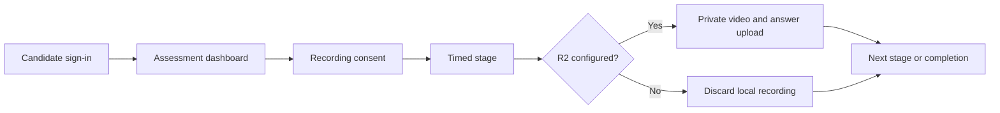

<div align="center">

# Secmentum

### Custom internship assessments for technical demos

[](https://nodejs.org/)
[](https://expressjs.com/)
[](https://developers.cloudflare.com/r2/)
[](LICENSE)

Run timed internship assessments with editable stages, candidate recording, and optional private object storage.

</div>

## Overview

Secmentum is an open-source starter kit for internship assessment flows. Teams can replace the sample brand, stages, durations, and questions through one JSON configuration file while keeping the candidate flow and recording pipeline intact.

The project covers the candidate path from secure entry to sequential stages, browser monitoring, consent-based camera and microphone recording, answer collection, and optional private Cloudflare R2 uploads.

> [!IMPORTANT]
> Secmentum is a technical demo, not a production hiring platform. It does not include an admin panel, database, scoring engine, tenant isolation, or automated hiring decisions.

## Features

| Capability | Description |
| --- | --- |
| Configurable assessments | Manage branding, stages, durations, and questions in `assessment.config.json` |
| Sequential candidate flow | Lock later stages until the active stage is completed |
| Timed sessions | Display a countdown and submit automatically when time expires |
| Recording consent | Request camera and microphone access before recording begins |
| Resilient recording | Store short MediaRecorder chunks in IndexedDB during the stage |
| Optional private storage | Upload WebM recordings and answer reports to Cloudflare R2 |
| Demo fallback | Run the full flow without cloud credentials and discard local recordings safely |
| Assessment monitoring | Detect fullscreen exits, tab changes, and connection loss |

## Technology

- **Runtime:** Node.js 20+
- **Server:** Express 5 and server-side sessions
- **Frontend:** Vanilla HTML, CSS, and JavaScript
- **Recording:** MediaRecorder API and IndexedDB
- **Storage:** Cloudflare R2 through the AWS S3 SDK
- **Tests:** Built-in `node:test` runner

## Architecture



## Quick start

Requirements: Node.js 20 or newer.

```bash
git clone <repository-url>
cd secmentum
npm install
copy .env.example .env
npm start
```

Open `http://localhost:2500` and use the development code `DEMO-ACCESS`.

On macOS or Linux, replace the copy command with `cp .env.example .env`.

R2 is not required for local evaluation. The application reports demo mode and discards completed recordings after the flow finishes.

## Customize the assessment

Edit [`assessment.config.json`](assessment.config.json):

```json
{
  "brand": {
    "name": "Secmentum",
    "tagline": "A customizable internship assessment tool"
  },
  "stages": [
    {
      "id": 1,
      "title": "Work Style",
      "durationMinutes": 5,
      "questions": [
        {
          "id": 1,
          "text": "Your question",
          "options": ["Option A", "Option B"]
        }
      ]
    }
  ]
}
```

Use an empty `options` array for a free-text response. Keep stage IDs sequential, starting at `1`.

## Environment

| Variable | Required | Purpose |
| --- | --- | --- |
| `PORT` | No | HTTP port; defaults to `2500` |
| `ACCESS_CODE` | Production | Candidate access code |
| `SESSION_SECRET` | Production | Session signing secret; use at least 32 random characters |
| `R2_ENDPOINT` | For uploads | Cloudflare R2 S3 endpoint |
| `R2_REGION` | For uploads | Usually `auto` |
| `R2_ACCESS_KEY_ID` | For uploads | R2 access key ID |
| `R2_SECRET_ACCESS_KEY` | For uploads | R2 secret access key |
| `R2_BUCKET_NAME` | For uploads | Private R2 bucket |

If all R2 values are absent, Secmentum runs in demo mode. Recording still runs locally, then the browser data is discarded instead of uploaded.

## Project structure

```text
.
├── assessment.config.json   # Brand, stages, durations, and sample questions
├── server.js                # Express routes, sessions, validation, and R2 uploads
├── public/                  # Candidate-facing pages, styles, and browser logic
├── test/smoke.test.js       # End-to-end API and security smoke checks
├── uploads/tmp/             # Temporary recording files; ignored by Git
└── .env.example             # Safe environment-variable template
```

## API

| Method | Route | Purpose |
| --- | --- | --- |
| `GET` | `/api/config` | Public brand and storage status |
| `POST` | `/api/login` | Start a candidate session |
| `GET` | `/api/dashboard` | Candidate and stage progress |
| `GET` | `/api/stages/:id/questions` | Questions for the available stage |
| `POST` | `/api/stage/start` | Start the next stage |
| `POST` | `/api/upload` | Upload a WebM recording, maximum 256 MB |
| `POST` | `/api/upload-answers` | Upload the text answer report |
| `POST` | `/api/stage/complete` | Complete the active stage |

## Security and privacy

Recordings and assessment answers can contain sensitive personal data. Before using Secmentum with real candidates:

1. Obtain clear, informed consent.
2. Keep the R2 bucket private and apply least-privilege credentials.
3. Define retention, access, export, and deletion procedures.
4. Replace the in-memory session store and demo access-code authentication.
5. Add tenant isolation, audit logging, rate limiting, and your jurisdiction's required privacy notices.

Never commit `.env`, exported mailboxes, recordings, or candidate data. API responses intentionally omit infrastructure details, and upload object keys use random candidate IDs instead of names or email addresses.

## Development

```bash
npm run dev
npm test
npm audit --omit=dev
```

## License

[MIT](LICENSE)
